# 🧱 Fundamentos Essenciais para Backend

> Antes da arquitetura, dos microsserviços e do "system design" chique: domine a base. Esse é o roadmap de fundamentos que sustenta qualquer carreira sólida em backend — sem atalho, sem pular etapa.

---

## Por que esse roadmap existe

É muito comum (principalmente pra quem tá começando) pular direto pra Kafka, microsserviços e arquitetura distribuída antes de dominar o básico — e isso geralmente termina em frustração, porque essas coisas avançadas só fazem sentido quando o alicerce já está sólido.

Esse repositório organiza os **10 passos essenciais** que vêm antes de qualquer assunto avançado, na ordem em que fazem mais sentido pra estudar. A ideia é simples: **dominar lógica, dados, backend e redes primeiro — só depois ir pro resto.**

## 🧭 01 · Por Onde Começar

**Às vezes a gente se sente perdido sobre o que estudar primeiro.**

Quinze abas abertas, dez roadmaps diferentes, todo mundo dizendo que você devia estar estudando outra coisa. Esse roadmap existe pra resolver exatamente isso.

- Um caminho linear, sem atalho
- Da lógica até backend, redes e ferramentas do dia a dia
- 10 passos, nessa ordem — sem pular nenhum
- Só depois disso: arquitetura, microsserviços e system design

> *Você não precisa saber tudo agora. Precisa saber o que vem primeiro.*

---

## 🗺️ Os 10 passos

```mermaid
flowchart LR
    A["🧭 01<br/>Por Onde Começar"] --> B["🧠 02<br/>Lógica"]
    B --> C["📦 03<br/>Estruturas de Dados"]
    C --> D["🏗️ 04<br/>POO"]
    D --> E["⚡ 05<br/>Algoritmos"]
    E --> F["🗄️ 06<br/>Banco de Dados"]
    F --> G["🌐 07<br/>Redes"]
    G --> H["🔌 08<br/>APIs"]
    H --> I["☁️ 09<br/>Backend Fundamentals"]
    I --> J["🔧 10<br/>Git e Linux"]
    J --> K["🚀 11<br/>Próximos Passos"]

    classDef rose fill:#fb7185,color:#1b0610,stroke:none;
    classDef blue fill:#3b82f6,color:#ffffff,stroke:none;
    classDef emerald fill:#10b981,color:#04130d,stroke:none;
    classDef violet fill:#8b5cf6,color:#ffffff,stroke:none;
    classDef amber fill:#f59e0b,color:#160d04,stroke:none;
    classDef red fill:#ef4444,color:#ffffff,stroke:none;
    classDef teal fill:#14b8a6,color:#04120f,stroke:none;
    classDef cyan fill:#06b6d4,color:#03141a,stroke:none;
    classDef gold fill:#eab308,color:#140f02,stroke:none;
    classDef indigo fill:#6366f1,color:#ffffff,stroke:none;
    classDef fuchsia fill:#a855f7,color:#ffffff,stroke:none;

    class A rose
    class B blue
    class C emerald
    class D violet
    class E amber
    class F red
    class G teal
    class H cyan
    class I gold
    class J indigo
    class K fuchsia
```



### ✅ Seu progresso

Marque conforme for estudando cada etapa (edite o arquivo e troque `[ ]` por `[x]`):

- [ ] 02 · Lógica de Programação
- [ ] 03 · Estruturas de Dados
- [ ] 04 · POO
- [ ] 05 · Algoritmos
- [ ] 06 · Banco de Dados
- [ ] 07 · Redes de Computadores
- [ ] 08 · APIs
- [ ] 09 · Backend Fundamentals
- [ ] 10 · Git e Linux
- [ ] 11 · Próximos Passos

---

### 02 · 🧠 Lógica de Programação
**A base de toda linguagem.**
- Variáveis e tipos de dados
- Operadores lógicos e matemáticos
- Condicionais (if/else, switch)
- Laços (for, while)
- Funções e métodos

> *Se você não domina lógica, qualquer linguagem parecerá difícil.*

### 03 · 📦 Estruturas de Dados
**Aprenda como os dados são organizados.**
- Arrays e Listas
- Pilhas (Stack)
- Filas (Queue)
- HashMap / Dicionários
- Sets e Collections

> *Grandes sistemas são construídos sobre boas estruturas de dados.*

### 04 · 🏗️ POO
**Programação Orientada a Objetos — essencial para Java e backend.**
- Classes e Objetos
- Encapsulamento
- Herança
- Polimorfismo
- Abstração

> *POO ensina a modelar problemas do mundo real em código.*

### 05 · ⚡ Algoritmos
**Escreva código eficiente.**
- Busca Linear e Binária
- Algoritmos de Ordenação
- Recursão
- Dois Ponteiros
- Sliding Window

> *Não basta funcionar. Precisa escalar.*

### 06 · 🗄️ Banco de Dados
**Todo sistema armazena dados.**
- SQL básico
- SELECT, INSERT, UPDATE e DELETE
- JOINs
- Índices
- Modelagem de tabelas

> *Um banco mal projetado pode derrubar um sistema inteiro.*

### 07 · 🌐 Redes de Computadores
**Entenda como aplicações se comunicam.**
- HTTP e HTTPS
- DNS
- TCP/IP
- Latência
- Load Balancer

> *Antes de distribuir sistemas, entenda como a internet funciona.*

### 08 · 🔌 APIs
**A cola que conecta sistemas.**
- REST APIs
- JSON
- Métodos HTTP
- Status Codes
- Autenticação (JWT)

> *Hoje praticamente todo software conversa com APIs.*

### 09 · ☁️ Backend Fundamentals
**O coração das aplicações.**
- CRUD
- Validações
- Tratamento de erros
- Logs
- Cache

> *Backend não é só criar endpoints.*

### 10 · 🔧 Git e Linux
**Ferramentas do dia a dia de um desenvolvedor.**
- Git Commit
- Branches
- Merge e Rebase
- Comandos Linux
- Deploy básico

> *Você usa essas ferramentas todos os dias em empresas.*

### 11 · 🚀 Próximos Passos
Só depois de dominar tudo acima, vá para:
- ✅ Arquitetura de Software
- ✅ Microsserviços
- ✅ Mensageria (Kafka/RabbitMQ)
- ✅ System Design
- ✅ Sistemas Distribuídos
- ✅ Escalabilidade
- ✅ Cloud (AWS/GCP/Azure)

---

## 🛠️ Como usar este repositório

1. Dê um fork ou clone neste repositório.
2. Leia este README de ponta a ponta, na ordem.
3. Vá marcando os checkboxes da seção **Seu progresso** conforme for estudando.
4. Use as etapas como guia de estudo — e os links/quotes como lembrete de "por que isso importa".

```bash
git clone https://github.com/davidlimma007/fundamentos-essenciais-backend.git
```

## 📫 Sobre

Roadmap organizado por [@davidlimma007](https://github.com/davidlimma007), estudante de ADS e backend developer (Java/Spring Boot/PostgreSQL), como parte do próprio processo de estudo — e compartilhado pra quem também está construindo essa base.

Sugestões e contribuições são bem-vindas via issue ou pull request.
